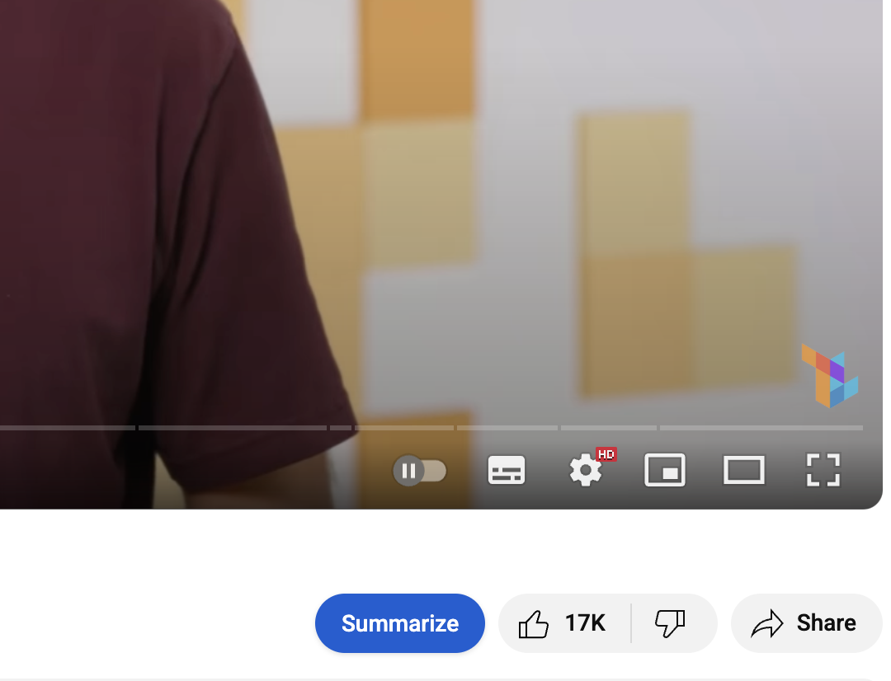

# YouTube Video Summarizer

A Chrome extension that adds a "Summarize" button to YouTube video pages, which uses Google's Gemini API to generate concise summaries of videos.

{ width=60% }

## Features

- Adds a "Summarize" button next to the like counter on YouTube video pages
- Generates concise summaries of YouTube videos using the Gemini API
- Displays summaries in a popup window with styling similar to YouTube's share popup
- Stores your Gemini API key securely

## Installation

### From Source Code

1. Clone or download this repository
2. Open Chrome and navigate to `chrome://extensions/`
3. Enable "Developer mode" (toggle in the top right)
4. Click "Load unpacked" and select the folder containing the extension files
5. The extension should now be installed and active

## Configuration

Before using the extension, you need to set up your Gemini API key:

1. Get a Gemini API key from [Google AI Studio](https://ai.google.dev/)
2. Click on the extension icon in your Chrome toolbar
3. Enter your API key in the provided field and click "Save"

## Usage

1. Navigate to any YouTube video
2. Click the "Summarize" button to the left of the like counter
3. A popup will appear with a generated summary of the video

## How It Works

1. The extension injects a "Summarize" button on YouTube video pages
2. When clicked, it sends the video URL and title to the Gemini API
3. The API generates a concise summary focusing on main points
4. The summary is displayed in a popup similar to YouTube's share popup

## Development

The extension consists of the following files:

- `manifest.json`: Chrome extension configuration
- `content.js`: Injects the Summarize button on YouTube pages
- `background.js`: Handles API communication with Gemini
- `popup.html`/`popup.js`: UI for API key configuration
- `styles.css`: Styling for the button and popup

## Privacy

The extension only sends the following data to the Gemini API:
- The URL of the YouTube video
- The title of the YouTube video

The API key is stored locally in your browser and is never sent to any server besides Google's Gemini API.

## License

This project is available under the MIT License. See the LICENSE file for details.
